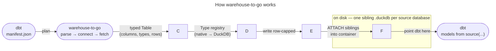

# Warehouse-to-Go

Create a local **DuckDB** mirror of your data-warehouse sources so your dbt project runs
against tiny, instant local copies instead of the real warehouse.

The tool reads your dbt project's `manifest.json`, connects to the warehouse, extracts each
source table, and writes a faithful — but small, capped, and fast — copy back onto disk. You then
point dbt at that local copy and run normally using a tool dbt-polyglot to transpile sql dialects.

<div align="center">
  
</div>

## ✨ Why

warehouse-to-go exists for two reasons.

- **Data stays available offline.** Once a source is mirrored, it lives on disk — no warehouse
  login, no API gateway, and no internet needed to query it. A local copy is a permanent data
  island you can build against anytime.
- **Cloud costs stay down.** Running dbt against a huge warehouse pays for planning, catalog scans,
  warehouse concurrency, and auth round-trips on every query. A tiny local copy runs fast and nearly free.

A `row_limit` lets you grab a capped slice of each table just for local work, and you iterate on your
logic and SQL against local copies — your warehouse and production queries stay untouched.

warehouse-to-go gives you a **local DuckDB** whose `database.schema.table` namespace matches the warehouse,
seeded from that capped snapshot of your real sources.

## 📦 Installation

```bash
git clone https://github.com/dancorley/warehouse-to-go.git
cd warehouse-to-go

# 1. Create and activate a virtual environment (recommended)
python3 -m venv .venv
source .venv/bin/activate      # On Windows: .venv\Scripts\activate

# 2. Install
uv pip install -e .
```

## 🧪 Try it

A ready-to-run sample project lives in [`dbt/`](./dbt/):

```bash
# Seed a local mirror from the bundled sample sources
warehouse-to-go -m dbt/target/manifest.json extract

# Build + run your dbt models against the local DuckDB mirror
dbt build --project-dir dbt --target duck
```

See [dbt/README.md](./dbt/README.md) for the sample project's setup and commands.


## 🧱 How it works

warehouse-to-go is built around a clean split of responsibility. The CLI changes **zero code**
when you add a new warehouse — you only "select the adapter from config."



| Layer | Responsibility | Why it's separated |
|---|---|---|
| **Manifest parser** | Turns `manifest.json` into a `db.schema → [tables]` extraction plan | Same for every warehouse |
| **Config** | Picks the warehouse **type**, target, and where to write (`database_path`) | One selection point; no code forks |
| **SourceAdapter** | `connect` / `test_connection` / `fetch` / `close` / `quote_ident` | All source knowledge (auth, SQL, types, namespace) lives here |
| **Type registry** | Maps each warehouse's native type → DuckDB's type | Unit-testable; shared by adapter + sink |
| **DuckDB sink** | Attaches the databases, creates schemas, writes typed rows | Never sees Snowflake vs. Postgres vs. BigQuery |

The connector between source and sink is a **typed intermediate** — each `fetch()` yields a `Table`
object whose `rows` is a `pyarrow.Table` with column names, types, and nullability from the source.
The sink writes each table with a single `CREATE OR REPLACE TABLE ... AS SELECT * FROM <arrow>` —
no batching, no Python-object round-trip.

## 🧠 Key design decisions (locked, so the architecture doesn't drift)

1. **DuckDB is a pure sink.** The sink knows only `Type` + a `CatalogLayout`; it never knows which
   warehouse the data came from. Add an adapter → no sink changes.
2. **One database per namespace on disk.** The configured `database_path` is the **primary
   container** `.duckdb`. Every source namespace becomes its own **sibling** `.duckdb` in the
   container's directory. The sink `ATTACH`es each sibling and writes its schemas into the
   container. **The number of databases is not fixed** — it's adapter-declared and user-configurable.
3. **`row_limit` caps each table independently** (default `10000`). It is *not* the total row budget —
   each table gets up to `row_limit` rows.
4. **The CLI is generic.** "Select the adapter from `warehouse.type`; run." — the same command works
   for any warehouse once an adapter ships.

```
db               DuckDB database  DuckDB schema  DuckDB table   Storage
─────────────────────────────────────────────────────────────────────────────────────
Snowflake        database         schema         table          one .duckdb per database, ATTACHed
Postgres         _default         schema         table          one .duckdb by default
BigQuery         project          dataset        table          one .duckdb per project, ATTACHed
```

## ⚙️ Configuration

### `config.yml`

A `config.yml` in your project directory customizes the tool. Values are also settable on the
command line (`--profile`, `--target`, `--config`, `--manifest`).

```yaml
# config.yml
warehouse:
  # Which dbt profile holds your warehouse credentials.
  # If omitted, the first warehouse profile is used.
  profile_name: portable_warehouse

  # Which target within that profile (default: the profile's target).
  target: snow

  # Which adapter to use. Defaults to snowflake (Snowflake is the reference
  # adapter right now); post/anything else is selected automatically once the
  # matching adapter is implemented.
  type: snowflake

duckdb:
  # Directory that holds the primary container .duckdb AND every source
  # database's sibling .duckdb. This is the root dbt points at.
  database_path: warehouse_mirror.duckdb

extract:
  # Max rows per table. Capped per-table (default 10,000) — speeds local iteration.
  row_limit: 10000
```

### Configuration precedence

1. Command-line options (`--profile`, `--target`, `--config`, `--manifest`)
2. `config.yml` in the current directory (if present)
3. `~/.dbt/profiles.yml` for credentials (Snowflake now; any warehouse once its adapter ships)

warehouse-to-go reads your warehouse credentials from your existing dbt
`~/.dbt/profiles.yml`. It uses the profile and target named in `config.yml`, or the first
warehouse profile automatically.

## ▶️ Usage

```bash
# 1. Test warehouse + DuckDB setup
warehouse-to-go debug

# 2. List the sources dbt found, grouped by database.schema (with table counts)
warehouse-to-go -m dbt/target/manifest.json analyze

# 3. Preview what would be extracted from one source (no writes)
warehouse-to-go -m dbt/target/manifest.json extract --source sf100tcl --dry-run

# 4. Extract every reachable source into the local mirror
warehouse-to-go -m dbt/target/manifest.json extract

# 5. Run your dbt project against the local mirror (target: duck)
dbt build --project-dir dbt --target duck
```

- `analyze` groups sources by their `database.schema` and prints the table count per group —
  this is exactly the grouping each source namespace maps into the local mirror.
- `extract` prints per-table row counts as it goes, then a final **Extraction Summary** listing
  every table and its row count. `--source NAME` narrows to a single source.

## 💾 Storage model — how dbt consumes the mirror

This is the part most people ask about, so it deserves its own section.

The `database_path` is the **primary container** `.duckdb`. Alongside it the tool writes one
**sibling** `.duckdb` per source database. The container `ATTACH`es each sibling (by name) and
creates the schemas, so **the database.schema.table paths are identical to the warehouse** — only
the data lives locally and is row-capped.

```
warehouse_mirror.duckdb          ← primary container (what dbt connects to)
├── snowflake_sample_data.duckdb ← sibling (source database)
│     └── tpch_sf1              ← schema (tables inside)
└── other_source.duckdb         ← sibling, when the source has its own database
```

In `dbt/profiles.yml`, point the `duck` target at the container:

```yaml
duck:
  type: duckdb
  path: ./databases/warehouse_mirror.duckdb
  database: warehouse_mirror
  attach: # the ATTACHed siblings
    - path: databases/snowflake_sample_data.duckdb
      alias: snowflake_sample_data # aliased as named in warehouse
    - path: databases/other_source.duckdb
      alias: other_source
```

Now `select * from snowflake_sample_data.tpch_sf1.customer` resolves to your local, capped copy.
This layout scales: add another source database → another sibling `.duckdb` in the same directory,
and the sink picks it up automatically. **You don't have to pick a single merged file** — the
sibling-per-database model mirrors the warehouse and keeps each namespace isolated.


## 🗺️ Adapters

**Snowflake** is the reference adapter — implemented and verified end-to-end. Adding another
warehouse means writing one file that implements the `SourceAdapter` protocol; the CLI, sink,
manifest parsing, and tests change nothing.

| Warehouse | Status |
|---|---|
| Snowflake | ✅ Reference adapter (live connection + CLI end-to-end) |
| Postgres | 🚧 Planned — `psycopg` + DuckDB transpile is a quick win |
| BigQuery | 🚧 Planned — service-account keyfile auth; native DuckDB extension |


## 🔎 What's tested

The suite (15 tests) locks the machinery — nothing here should silently regress:

- **Types** — Snowflake→DuckDB type mapping (`NUMBER(38,6)` → `DECIMAL(38,6)`, unknown → `DOUBLE`)
- **Registry** — adapter dispatch by `warehouse.type`, clear error for unknown types
- **Sink** — typed writes, multiple sibling databases, empty-table handling,
  and a guard against writing to an unexpected database
- **Config** — `from_dbt_profile` groups sources correctly and rejects unsupported warehouses

